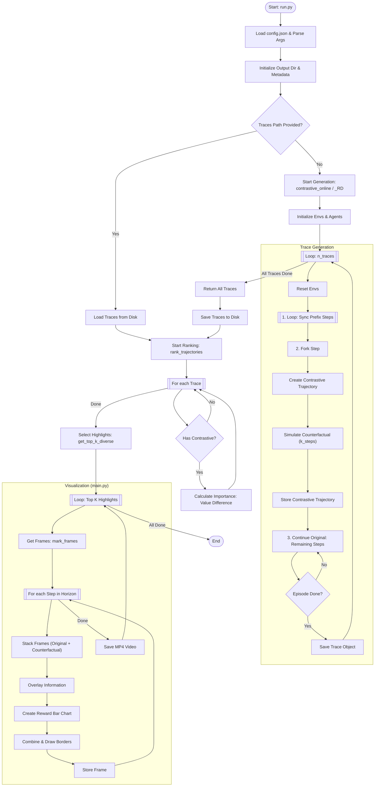

# COViz-Taxi Algorithm Diagram

```mermaid
flowchart TD
    Start(["Start: run.py"]) --> LoadConfig["Load config.json & Parse Args"]
    LoadConfig --> Init["Initialize Output Dir & Metadata"]
    
    Init --> CheckPath{"Traces Path Provided?"}
    
    CheckPath -- Yes --> LoadTraces["Load Traces from Disk"]
    
    CheckPath -- No --> GenStart["Start Generation: contrastive_online / _RD"]
    GenStart --> InitEnvs["Initialize Envs & Agents"]
    InitEnvs --> LoopTraces[["Loop: n_traces"]]
    
    subgraph TraceGen ["Trace Generation"]
        LoopTraces --> Reset["Reset Envs"]
        Reset --> PrefixLoop[["1. Loop: Sync Prefix Steps"]]
        PrefixLoop --> ForkNode["2. Fork Step"]
        
        ForkNode --> Fork["Create Contrastive Trajectory"]
        Fork --> SimContra["Simulate Counterfactual (k_steps)"]
        SimContra --> StoreContra["Store Contrastive Trajectory"]
        
        StoreContra --> ContinueOrig["3. Continue Original: Remaining Steps"]
        ContinueOrig --> EndEp{"Episode Done?"}
        EndEp -- No --> ContinueOrig
        EndEp -- Yes --> SaveTrace["Save Trace Object"]
        SaveTrace --> LoopTraces
    end
    
    LoopTraces -- All Traces Done --> ReturnTraces["Return All Traces"]
    ReturnTraces --> SaveTracesDisk["Save Traces to Disk"]
    LoadTraces --> RankStart
    SaveTracesDisk --> RankStart
    
    RankStart["Start Ranking: rank_trajectories"] --> RankLoop[["For each Trace"]]
    RankLoop --> CheckContra{"Has Contrastive?"}
    CheckContra -- Yes --> CalcScore["Calculate Importance: Value Difference"]
    CheckContra -- No --> RankLoop
    CalcScore --> RankLoop
    RankLoop -- Done --> SelectDiverse["Select Highlights: get_top_k_diverse"]
    
    SelectDiverse --> VizLoop[["Loop: Top K Highlights"]]
    
    subgraph Viz ["Visualization (main.py)"]
        VizLoop --> GetFrames["Get Frames: mark_frames"]
        GetFrames --> LoopFrames[["For each Step in Horizon"]]
        LoopFrames --> Stack["Stack Frames (Original + Counterfactual)"]
        Stack --> Overlay["Overlay Information"]
        Overlay --> Rewards["Create Reward Bar Chart"]
        Rewards --> Combine["Combine & Draw Borders"]
        Combine --> StoreFrame["Store Frame"]
        StoreFrame --> LoopFrames
        LoopFrames -- Done --> SaveVideo["Save MP4 Video"]
    end
    
    SaveVideo --> VizLoop
    VizLoop -- All Done --> End(["End"])
```
