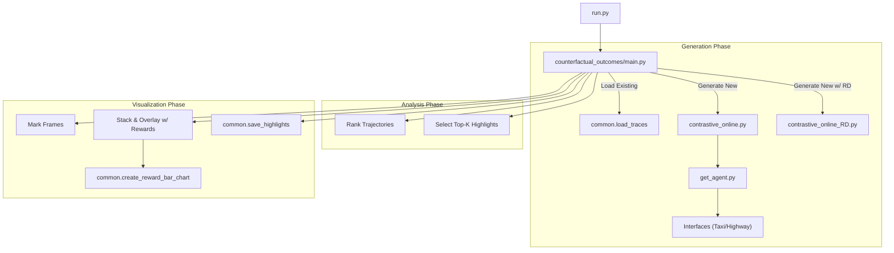

# COViz-Taxi Library Documentation

This library is designed for generating, analyzing, and visualizing counterfactual outcomes in reinforcement learning environments (specifically Highway and Taxi). It compares an agent's original trajectory with alternative "counterfactual" trajectories to highlight important decision points.

## Architecture Overview

The pipeline consists of three main stages:
1.  **Generation/Loading**: Obtaining a set of execution traces (original behaviors) and generating contrastive trajectories (what if scenarios).
2.  **Ranking**: Scoring the contrastive trajectories to find the most interesting "disagreements" or highlights.
3.  **Visualization**: Rendering side-by-side videos of original vs. counterfactual outcomes, overlaid with reward information and metadata.



## The Algorithm

The library follows a systematic process to identify and visualize critical decision points in an agent's behavior.

### High-Level Procedure

1.  **Environment Sync**: Reset environment and agent. Ensure the seed is consistent for reproducibility.
2.  **Trace Selection**: 
    -   Run the agent's policy to collect a "True" execution trace (Sequence of States, Actions, and Rewards).
    -   Alternatively, load existing trace data from disk.
3.  **Counterfactual Branching (The "Fork")**:
    -   For every time-step $t$ in the original trace:
        -   Identify a sub-optimal or alternative action $a'_{t}$.
        -   Create a simulation branch: apply $a'_{t}$ at state $s_{t}$.
        -   Continue simulation for $K$ steps using the agent's original policy to see the "long-term" consequence of that single deviation.
4.  **Regret-Based Ranking**:
    -   Calculate the **Importance Score** for each branch.
    -   Standard metric: The difference in expected cumulative reward (Value) between the original action and the counterfactual action at the moment of the fork.
5.  **Diverse Highlight Selection**:
    -   Sort all branches by Importance.
    -   Filter and select the Top-$K$ most significant branches that are spatially or temporally diverse.
6.  **Synchronized Visualization**:
    -   Construct a dual-pane video frame.
    -   **Left Pane**: The original trajectory.
    -   **Right Pane**: The counterfactual trajectory.
    -   **Reward Timeline**: A dynamically scaled bar chart showing per-step rewards ($r_t$) for both paths.
    -   **State Preservation**: If one path ends earlier, freeze the final frame and mark it as "DONE" while the other continues.

### Pseudocode

```python
for trace in collection:
    for t in range(len(trace)):
        # Identify interesting alternate action
        alt_action = get_second_best_action(trace.state[t])
        
        # Rollout alternative future
        branch = rollout(trace.state[t], alt_action, duration=K_STEPS)
        
        # Calculate Importance (Regret)
        score = abs(V(state[t], orig_action) - V(state[t], alt_action))
        store_candidate(branch, score)

# Select Top-K Diverse Highlights
highlights = select_best(candidates, count=NUM_HIGHLIGHTS)

# Render
for hl in highlights:
    render_side_by_side_video(hl.orig, hl.contra, overlay=reward_bars)
```

## Modules and Functions

### Entry Point

#### `run.py`
The main entry script.
- **Purpose**: Parses command-line arguments, loads `config.json`, matches arguments to config values, and initiates the main pipeline.
- **Key Args**: `--traces-path`, `--interface`, `--n_traces`, `--k-steps`.

---

### Core Logic

#### `counterfactual_outcomes/main.py`
Orchestrates the entire workflow.
- **`contrastive_online(args)`**: Sets up environments and agents using `get_agent`, runs the online comparison loop (delegating to `contrastive_online_RD` or `contrastive_online`), and returns traces.
- **`rank_trajectories(traces, method)`**: Assigns importance scores to contrastive trajectories based on value differences or other metrics.
- **`get_top_k_diverse(traces, args)`**: Selects the most important and diverse highlights to avoid redundancy.
- **`main(args)`**: The primary procedure:
    1.  Getting traces.
    2.  Ranking and selection.
    3.  Generating visualizations (frames and videos).
    4.  Calls `create_reward_bar_chart` to add the reward timeline overlay.

#### `counterfactual_outcomes/common.py`
Shared utilities for data handling and rendering.
- **`Trace`, `State`**: Data structures for storing trajectory information.
- **`save_traces`, `load_traces`**: Pickle serialization helpers.
- **`hstack_frames(img1, text1, img2, text2)`**: Horizontally concatenates two frames with text captions at the bottom.
- **`mark_right_half_counterfactual(...)`**: Visual indicator (tint/border) to distinguish the counterfactual video feed.
- **`create_reward_bar_chart(...)`**: **[New]** Visualizes the per-step reward timeline for the entire episode, freezing the shorter trajectory display when it finishes.
- **`save_highlights(...)`**: Compiles frames into MP4 videos using `cv2.VideoWriter`.

---

### Generation

#### `counterfactual_outcomes/contrastive_online.py`
- **`ContrastiveTrajectory`**: Class managing a single counterfactual rollout.
- **`online_comparison(...)`**: Iterates through `n_traces`. For each step, it checks if a contrastive action is interesting (forking point) and generates a `ContrastiveTrajectory` by branching off the simulation.

#### `counterfactual_outcomes/contrastive_online_RD.py`
- **`online_comparison_RD(...)`**: Similar to the above but specifically collects **Reward Decomposition (RD)** values. This is crucial for environments where rewards are composed of multiple terms (e.g., time, success, illegal move costs).

#### `counterfactual_outcomes/get_agent.py`
- **`get_agent(args)`**: Factory function that initializes the specific `Interface` (Highway or Taxi) based on the configuration. It handles environment seeding and wrapper setup.
- **`get_config(...)`**: Robust config loader that searches for JSON configuration files in standard locations.

---

## Usage Example

To run the pipeline for the Taxi environment with existing traces:
```bash
python run.py --interface Taxi --traces-path ./traces/my_trace_folder
```

To generate new traces and visualize highlights:
```bash
python run.py --interface Taxi --n_traces 10 --k-steps 5 --num_highlights 3
```
